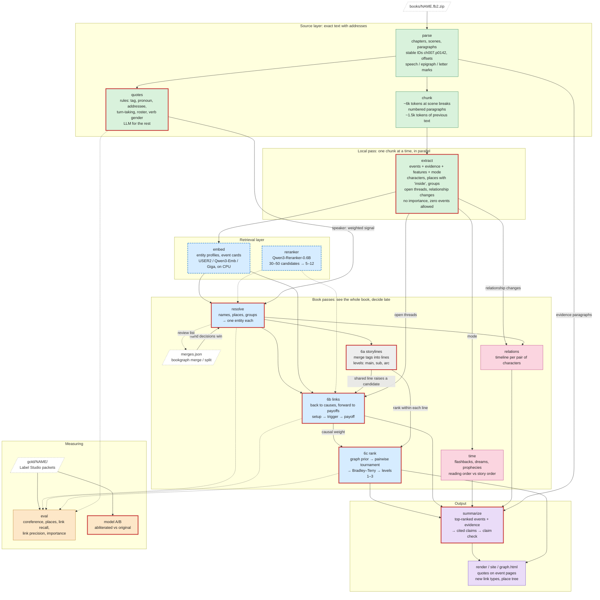
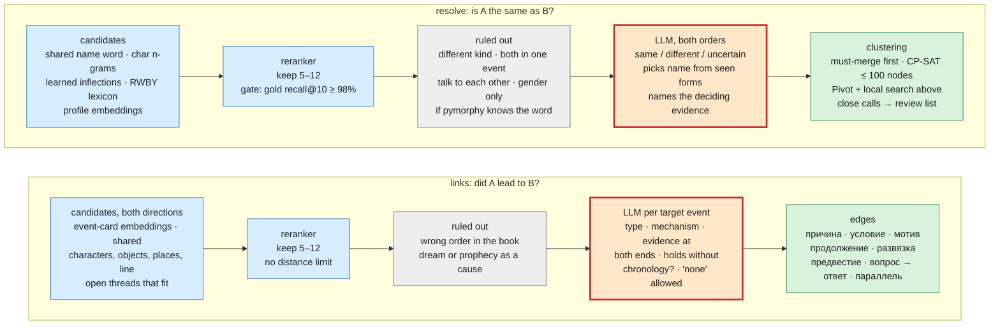
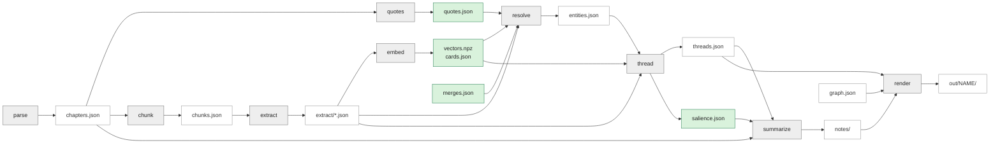

# How the pipeline should work

The target pipeline from [PLAN.md](../PLAN.md), drawn as three diagrams:

1. the whole pipeline;
2. the pattern of the two hardest stages (merging names and linking events);
3. which file each stage reads and writes.

Colours show the milestone that builds or changes each step. Steps with a
thick red border call the 27B model; blue dashed ones run small models
(embeddings, reranker); the rest need no model.

## 1. The whole pipeline

Milestones: M0 measuring ·
M1 no new extraction ·
M2 new extraction ·
M3 grounded notes ·
M4 deeper layers ·
kept as now

### Reading it

- **Source layer.** Everything later points back here. Generated text is
  never evidence; only paragraphs are.
- **Local pass.** Each chunk is read once, for recall. It records what is
  in the text and does not judge importance or identity: those need the
  whole book.
- **Retrieval layer.** Cheap models narrow thousands of candidates to tens,
  so the 27B model only decides between a few.
- **Book passes.** Every decision that needs the whole book: who is who,
  what caused what, what matters most. Decisions stay reversible: hand
  merges in `merges.json` override the model, and close calls go to a
  review list.
- **Output.** Notes are built from ranked, cited events, then each claim is
  checked against its paragraphs.
- **Measuring.** `eval` scores each book pass against the gold set after
  every change; the A/B test picks the model.

## 2. The candidate funnel (stages 5 and 6b)

Merging names and linking events follow the same pattern: find many
candidates cheaply, cut them, rule some out without a model, ask the model
about the rest, then decide globally.

`eval` measures each funnel at two points: how many gold pairs survive to
the LLM (recall of the candidate steps), and how many of the LLM's answers
are right (precision of the check). Mixing the two hides which half fails.

## 3. Files

White: files that exist now (some gain fields). Green: new files.
